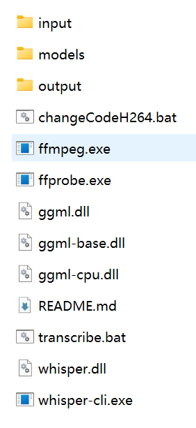

# WhisperToTxt

将 MP4 视频转换为文字内容的工具（基于 whisper.cpp），  
同时提供视频转码（H.264）功能，用于解决部分设备（如 TV）播放 MP4 有声音无图像的问题。

---

## ✨ 功能

- 🎙 视频转文字（支持中文）
- 📁 支持单文件 / 整个目录（递归）
- ⏱ 可统计音频时长
- 🧹 文本清洗功能
- 🎬 MP4 转 H.264 编码（兼容性更好）

---

## 📦 依赖环境

### 1️⃣ Whisper 模型（必须）

下载：

https://huggingface.co/ggerganov/whisper.cpp

推荐模型：

- ggml-small-q8_0.bin（速度快）
- ggml-large-v3-turbo.bin（精度高）

放入目录：

models/

---

### 2️⃣ 工具依赖

需要以下文件：

- ffmpeg.exe
- ffprobe.exe
- whisper-cli.exe

下载地址：

- ffmpeg: https://www.gyan.dev/ffmpeg/builds/
- whisper:https://huggingface.co/ggerganov/whisper.cpp/tree/main

---

## 📁 目录结构

project/
 ├─ transcribe.bat
 ├─ changeCodeH264.bat
 ├─ models/
 │   ├─ ggml-small-q8_0.bin
 │   └─ ggml-large-v3-turbo.bin
 ├─ bin/
 │   ├─ ffmpeg.exe
 │   └─ ffprobe.exe
 ├─ whisper-cli.exe
 ├─ input/
 ├─ output/

---

## 🚀 使用方法

### 🎙 视频转文字

transcribe.bat "input\test.mp4"

---

## ⚙ 参数说明

| 参数 | 说明 |
|------|------|
| large | 使用大模型（默认） |
| small | 使用小模型 |
| duration | 统计时长 |
| notime | 不生成时间戳文件 |
| clean | 清洗文本 |

---

## 参考：完整的文件及目录图

---

## 📄 License

MIT
